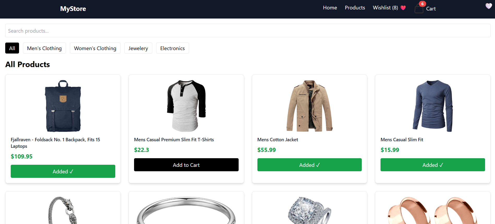
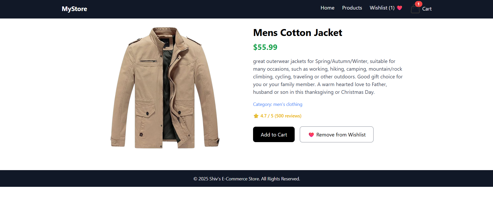
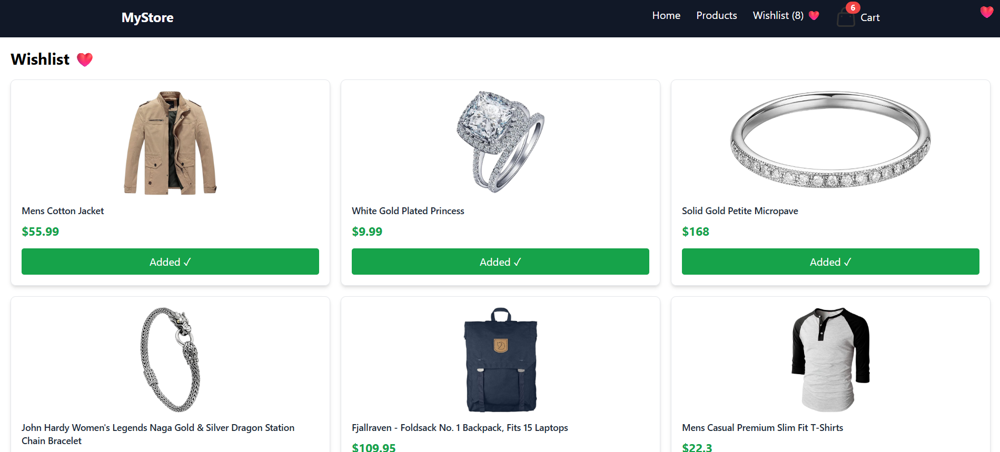
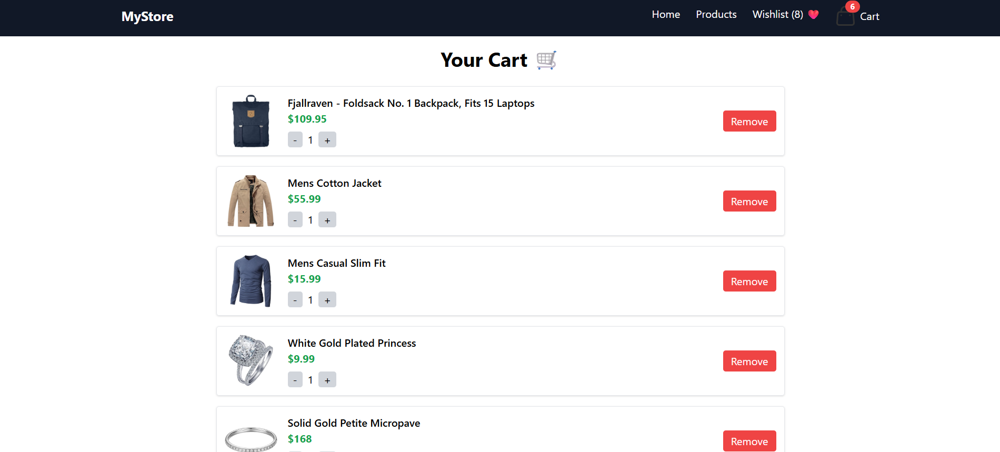

# 🛍️ MyStore - E-Commerce Web App

MyStore is a full-featured E-Commerce application built using **React**, **Context API**, and **Tailwind CSS**.  
It includes real product data from FakeStore API, responsive UI, and shopping features like cart and wishlist.

---

## 🚀 Live Demo  
🔗 https://ecommerce-store-sooty-nine.vercel.app/

---

## ✨ Features

✔ Real-time product listing using FakeStore API  
✔ Product detail page with rating, description & category  
✔ Add to Cart / Remove from Cart  
✔ Wishlist ❤️ Toggle System  
✔ Search + Category Filters  
✔ Responsive Navbar with Mobile Menu  
✔ Skeleton Loading (Shimmer UI)  
✔ Professional UI using TailwindCSS  
✔ Context API for global state management  
✔ Fully Responsive across devices 📱💻  

---

## 🛠️ Tech Stack

| Technology | Usage |
|-----------|-------|
| **React.js** | Frontend UI |
| **React Router** | Page navigation |
| **Context API** | Cart & Wishlist state |
| **Tailwind CSS** | Styling |
| **FakeStore API** | Product data |

---

## 📸 Screenshots

### 🏠 Home Page  

### 📦 All Products Page  

### 🔍 Product Details Page  

### ❤️ Wishlist Page  

### 🛒 Cart Page  

---

## 👨‍💻 Developer

**Shiv**  
Frontend Developer | React Enthusiast 🚀  
GitHub: https://github.com/Shivshankar646

---

## 📜 License

This project is open source for learning purposes.

---

### ⭐ Don’t forget to star the repo if you like it!
